*NOTE:* This file is a template that you can use to create the README for your project. The *TODO* comments below will highlight the information you should be sure to include.

# Your Project Title Here

*TODO:* Write a short introduction to your project.

In this project I explore both AutoML and Scikit-learn random forest model (that has its hyperparameters tuned with HyperDrive) in a task of predicting
stock market. More specifically, I'm trying to predict whether the Dow Jones Industrial Average goes up or down based on several fundamental and technical
features. 

## Project Set Up and Installation
*OPTIONAL:* If your project has any special installation steps, this is where you should put it. To turn this project into a professional portfolio project, you are encouraged to explain how to set up this project in AzureML.

## Dataset

### Overview
*TODO*: Explain about the data you are using and where you got it from.
This dataset is part of a data from UCI Machine Learning repository: https://archive.ics.uci.edu/ml/datasets/CNNpred%3A+CNN-based+stock+market+prediction+using+a+diverse+set+of+variables

In the original study they used not just DOW but also Nasdaq and other indexes in attempt to create a convolutional neural network for cross market prediction.
In this study I took a slightly less ambitious goal, and tried to just predict the movement of DOW.

I pre-processed the data a little bit by creating a new binary indicator feature that measured whether the stock index would go up or down the following trading day.
This indicator was then used as the label I tried to predict.

### Task
*TODO*: Explain the task you are going to be solving with this dataset and the features you will be using for it.

The task is to predict the overall movement of the stock market, as measured by the Dow. The dataset contains 82 pre-calculated features, full list of
which can be found in the appendix of this paper https://arxiv.org/pdf/1810.08923.pdf. In summary, these features include things like  
* Relative change of volume
* 10 days Exponential Moving Average
* Relative change of oil price(Brent) 
* Relative change in US dollar to Japanese yen exchange rate 

and so on, for each of the days.  in total the dataset contained data for 1984 days.

One important thing to keep in mind when doing prediction is not to accidentally "look into future". To avoid using future
data, I made sure that even the pre-processing steps only used data from the past. That is, when doing the normal
z-score standardization, I first calculated the mean and std from the first month of data (20 trading days), and
then used them in centering and normalizing the data:

``
normalized_df=(df3-df3.iloc[0:20].min())/(df3.iloc[0:20].max()-df3.iloc[0:20].min())
``

Similarly, when imputting missing features, I did not use things like median of all values for the feature (including 
the future), but a padding strategy where datapoints were filled based on last previously seen value. That way the
same approach could be used in real-life scenario where only past is known.

### Access
*TODO*: Explain how you are accessing the data in your workspace.
I uploaded the raw .csv file to the Azure ML Studio, then did some pre-processing as described earlier, and saved
pre-processed version to separate .csv file. Then I created a new dataset out of it that I registered to the 
workspace.

## Automated ML
*TODO*: Give an overview of the `automl` settings and configuration you used for this experiment

I chose AUC_weighted as the primary metric as it is suitable for a classification task.
Some of the settings like experiment time out were chosen as something that felt sensible.
The task was classification because I try to classify between situations where the DOW goes
up and down, and this label was stored in feature 'y' which was set as the label_column_name.
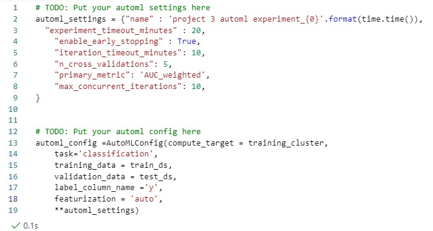

### Results
*TODO*: What are the results you got with your automated ML model? What were the parameters of the model? How could you have improved it?

The AutoML performed reasonably well  considering that the task is very difficult (predicting stock market). 

In the following screenshot we can see the parameters generated by the AutoML Model:

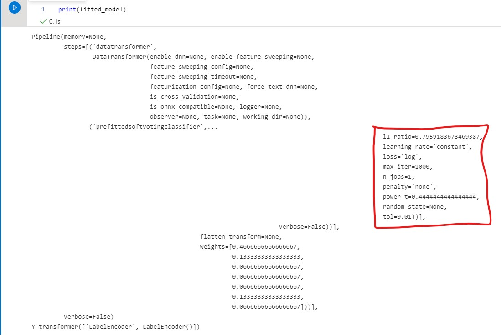
*TODO* Remeber to provide screenshots of the `RunDetails` widget as well as a screenshot of the best model trained with it's parameters.

For some reason the widget did not really update in my notebook even though I was in the Azure ML environment
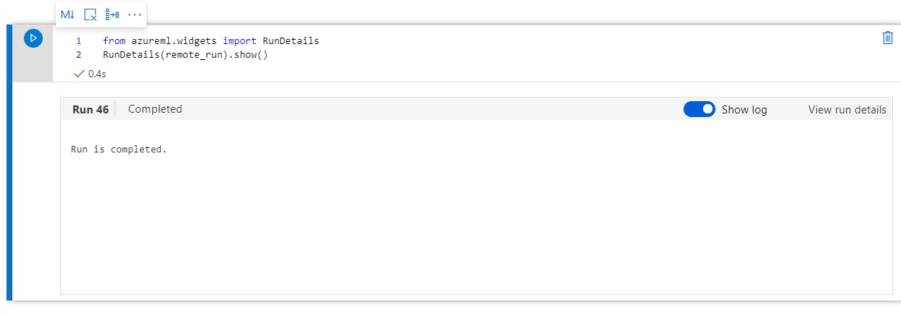

So here are also the details from the Azure ML Studio:
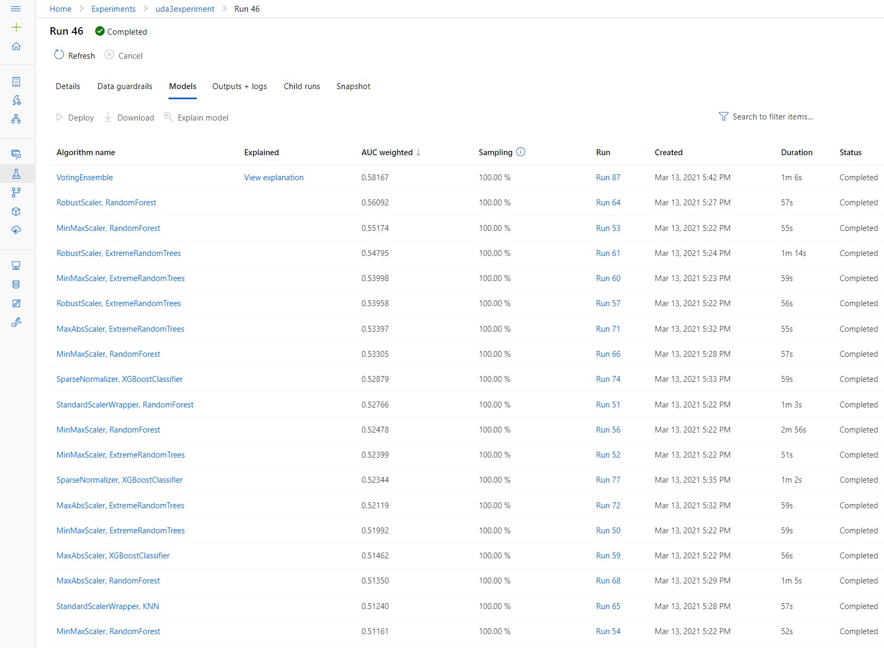

Here are the AutoML best model with its run id and score (this is different run because I had to
redo everything to address the reviewers comments):

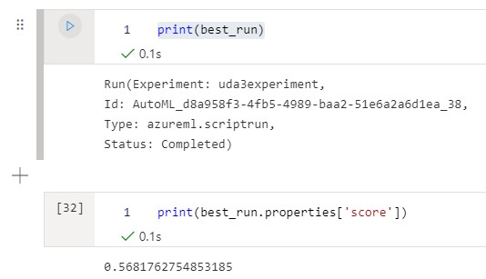

## Hyperparameter Tuning
*TODO*: What kind of model did you choose for this experiment and why? Give an overview of the types of parameters and their ranges used for the hyperparameter search

I chose random forest model, as I have had positive experience with it in the past. 
I explored hypertuning the following parameters:

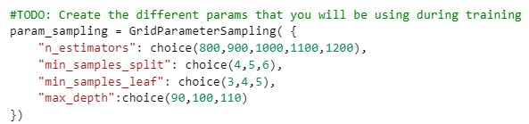

# Note!! Reviewer asked that the metrics needs to be logged, but they are already are in the script file :

### Results
*TODO*: What are the results you got with your model? What were the parameters of the model? How could you have improved it?
The random forest performed worse than AutoML, but still managed to edge slighty over chance level with 0.523 AUC score.
Performing feature selection before training the model could be useful to improve the performance. 

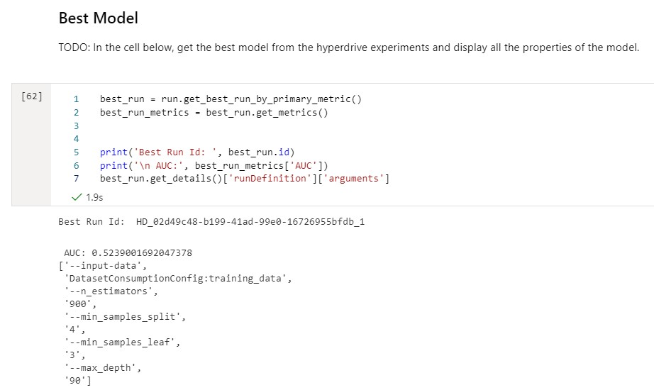

*TODO* Remeber to provide screenshots of the `RunDetails` widget as well as a screenshot of the best model trained with it's parameters.

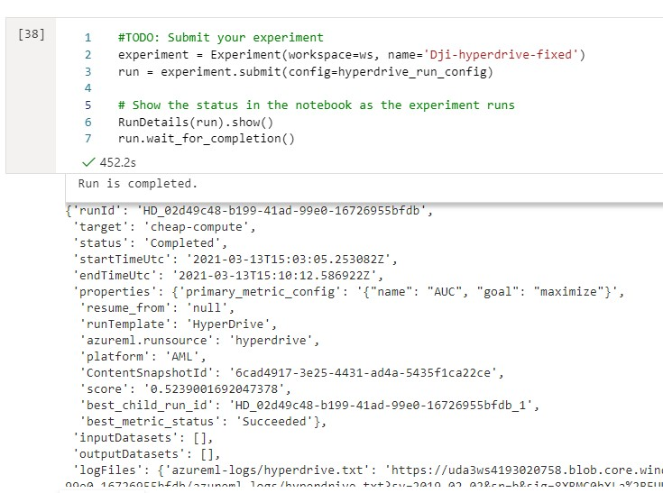

## Model Deployment
*TODO*: Give an overview of the deployed model and instructions on how to query the endpoint with a sample input.

I deployed the best AutoML as an AciWebservice that can be accessed via REST API:

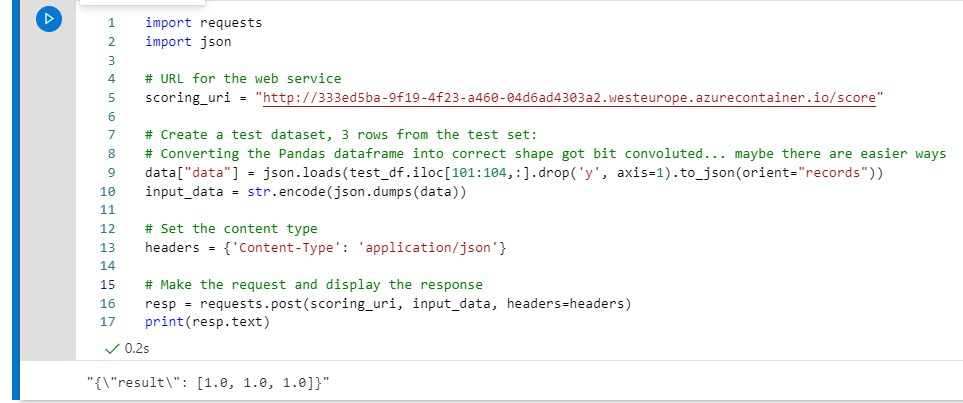

The scoring script was generated by AutoML 

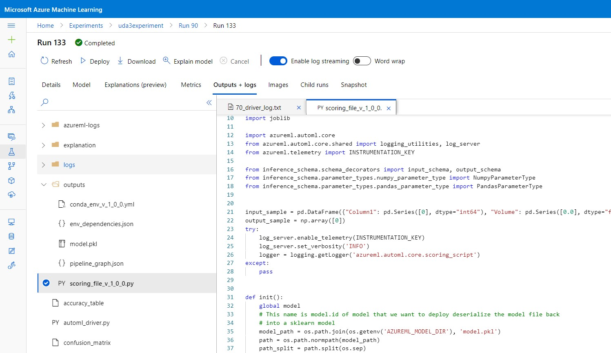
 
and I could access it with the following code:

``
best_run.download_file("outputs/scoring_file_v_1_0_0.py", "inference/score.py")
``

Also here is a screenshot of the environment details (the .yml file is also included in the github)

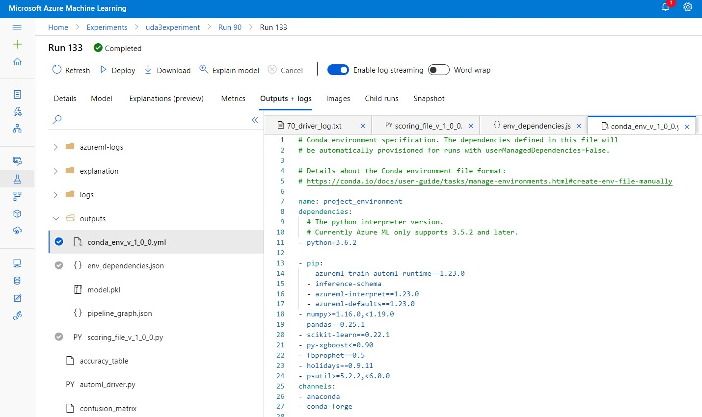

To deploy the model I needed to  generate an InferenceConfig with the scoring script and the
environment where to run it, and then create AciWebservice configuration defining number of cpu cores etc.
Will all of these at hand I could then use Model.deploy() to launch the service:

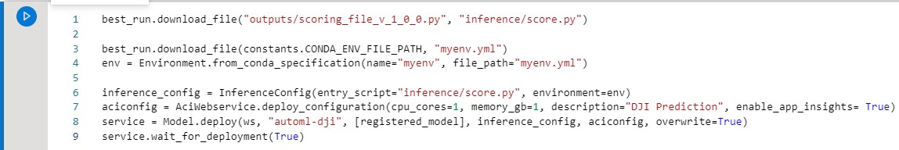

Here we can see the endpoint status as healthy:

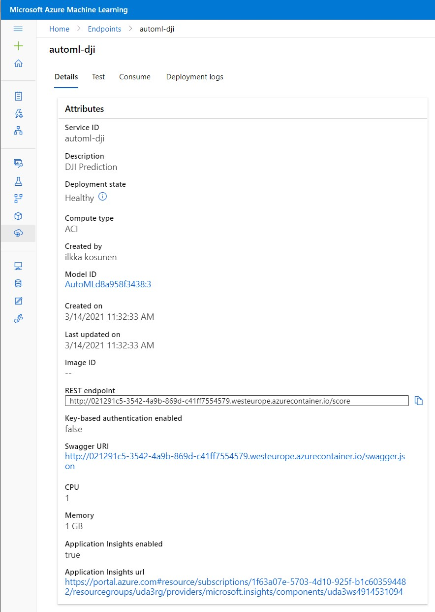

After the model is deployed I can use it by sending a HTTP Post request to the REST API endpoint with
sample data in the body of the post:

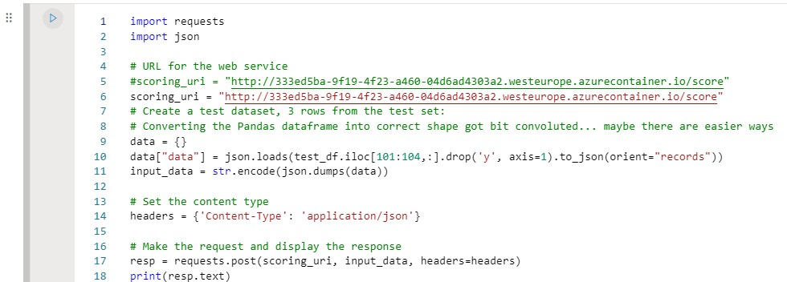

Here is an example the type of test input I could use:

``
{'data': [{'Column1': 408,
   'Volume': 0.1305078756,
   'mom': 1.0507590541,
   'mom1': 0.8714380537,
   'mom2': 1.5286026927,
   'mom3': -0.4686418116,
   'ROC_5': 1.407135642,
   'ROC_10': -0.1696156822,
   'ROC_15': -0.20950716,
   'ROC_20': -0.0598636721,
   'EMA_10': 6.0394001868,
   'EMA_20': 6.8606916156,
   'DTB4WK': -0.5,
   'DTB3': -1.75,
   'DTB6': -2.0,
   'DGS5': -4.96,
   'DGS10': -6.1904761905,
   'Oil': 0.919204956,
   'Gold': 0.5119415377,
   'DAAA': -2.8928571429,
   'DBAA': -2.5666666667,
   'GBP': 0.9696076544,
   'JPY': 0.6580117137,
   'CAD': 0.0583643028,
   'CNY': -2.5106086133,
   'AAPL': 0.924610071,
   'AMZN': 0.5322905941,
   'GE': 0.9361519103,
   'JNJ': 1.1725930792,
   'JPM': 0.929344597,
   'MSFT': 1.0304254556,
   'WFC': 1.2185841617,
   'XOM': 1.0838482703,
   'FCHI': 0.7828818606,
   'FTSE': 0.6620325256,
   'GDAXI': 0.6343438635,
   'GSPC': 1.0769996618,
   'HSI': 1.1447951281,
   'IXIC': 1.0668425413,
   'SSEC': 0.7489837306,
   'RUT': 1.1387563068,
   'NYSE': 1.0762082087,
   'TE1': -5.5909090909,
   'TE2': -5.7619047619,
   'TE3': -6.3684210526,
   'TE5': -0.1666666667,
   'TE6': -0.5,
   'DE1': 1.0,
   'DE2': 3.4705882353,
   'DE4': -2.3448275862,
   'DE5': -2.1935483871,
   'DE6': -2.3333333333,
   'CTB3M': 1.0495626826,
   'CTB6M': 0.2347826087,
   'CTB1Y': 0.959749553,
   'AUD': 0.9120603015,
   'Brent': 0.719017094,
   'CAC-F': 0.8045112782,
   'copper-F': 0.5040650407,
   'WIT-oil': 0.8918918919,
   'DAX-F': 0.6484716157,
   'DJI-F': 0.9537712895,
   'EUR': 1.0534979424,
   'FTSE-F': 0.7416666667,
   'gold-F': 0.7398601399,
   'HSI-F': 1.1311728395,
   'KOSPI-F': 0.5750487329,
   'NASDAQ-F': 0.9065217391,
   'GAS-F': 0.3117408907,
   'Nikkei-F': 0.7140255009,
   'NZD': 0.5732647815,
   'silver-F': 0.6760280843,
   'RUSSELL-F': 1.009310987,
   'S&P-F': 1.0818965517,
   'CHF': 0.876146789,
   'Dollar index-F': -0.125,
   'Dollar index': -0.1533742331,
   'wheat-F': 0.3985765125,
   'XAG': 0.8270321361,
   'XAU': 0.8}
}
``

## A short overview of how to improve the project in the future:

There are several ways to try and improve the model in the future. Obvious way would be to gather
more data. Indeed, the original dataset contained data for other stock indexes such as Nasdaq, and adding
those could help also improve the performance for Dow as well. Taking into account the slightly unbalanced data
could help: there might be slightly more days when DOW goes up than down. Taking training set where there is
same amount of both up and down days could be somethign to check out. However, in real-life the DOW also has
tendency to go up, so the model should be able to work also taking this into account. Thats why I'm using AUC
as primary metric and not just accuracy, as accuracy is not a good metric with unbalanced data.

Cross-validation could be another option: that is, splitting the dataset into 10 folds, and then running the
algorithm 10 times, everytime holding one fold as the testing set. AutoML has support of cross-validation, but 
it has to be enabled.

Also, instead of just doing gridsampling for hyperparameters, I could
first run Random sampling with much larger scope of hyperparamters to generate a kind of idea of what the best
hyperparameter values might be, and then fine tune them by doing gridsearch around the values that random search found.

However, my main improvement will be following the very complicated idea presented in the original paper featuring
this dataset: there they used convolutional neural networks to take in data for several different stock indexes 
(not just Dow but also Nasdaq etc.) and attempted to use the deep learning approach with convolutional kernels that
took as input the features calculated for several different indexes. Unfortunately that approach was beyond the
scope of this project.

Also, I'm planning to explore methods that are made speficially for time-series forecasting, such as the ones
described here: https://docs.microsoft.com/en-us/azure/machine-learning/how-to-auto-train-forecast

## Screen Recording
*TODO* Provide a link to a screen recording of the project in action. Remember that the screencast should demonstrate:
- A working model
- Demo of the deployed  model
- Demo of a sample request sent to the endpoint and its response

Here is the link to the screencast: https://youtu.be/RPxKbKtBBTM

## Standout Suggestions
*TODO (Optional):* This is where you can provide information about any standout suggestions that you have attempted.
